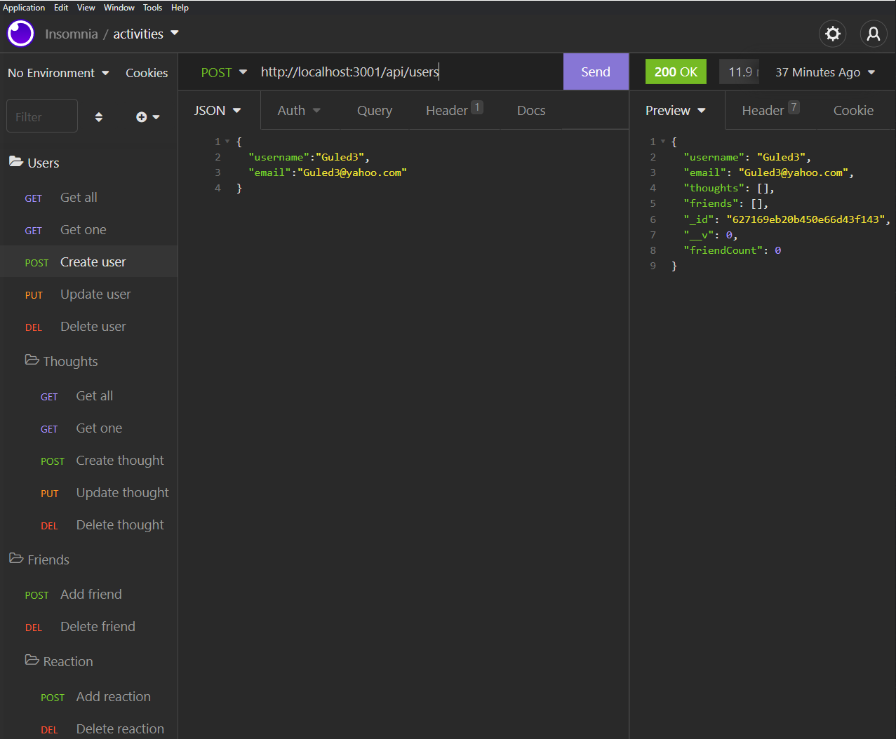

# Social-network-api

## The Motivation
This challenge was my introduction to NoSQL databases. To be specific, I use MongoDB in this challenge and it has grown my flexibility in back end technologies for applications I can create on the fly.

## Challenges
There were a couple challenges in this assignment, but not as it was like using SQL. MongoDB is very adaptable and it was a great transition from SQL. The main issue was getting the reactions to get added to the thoughts and same with the adding of friends. The virtuals werent working as in showing the amount of friends for example, but through trial and error I succeeded.

## Screenshot

[Walkthrough 1](https://drive.google.com/file/d/17WIZ8eudLL8kKpC6rGZgQOcBVOLP3y2U/view)

[Walkthrough 2](https://drive.google.com/file/d/1Bwqfibt8rkHJb-PavWUCjTZShsInTNU5/view)